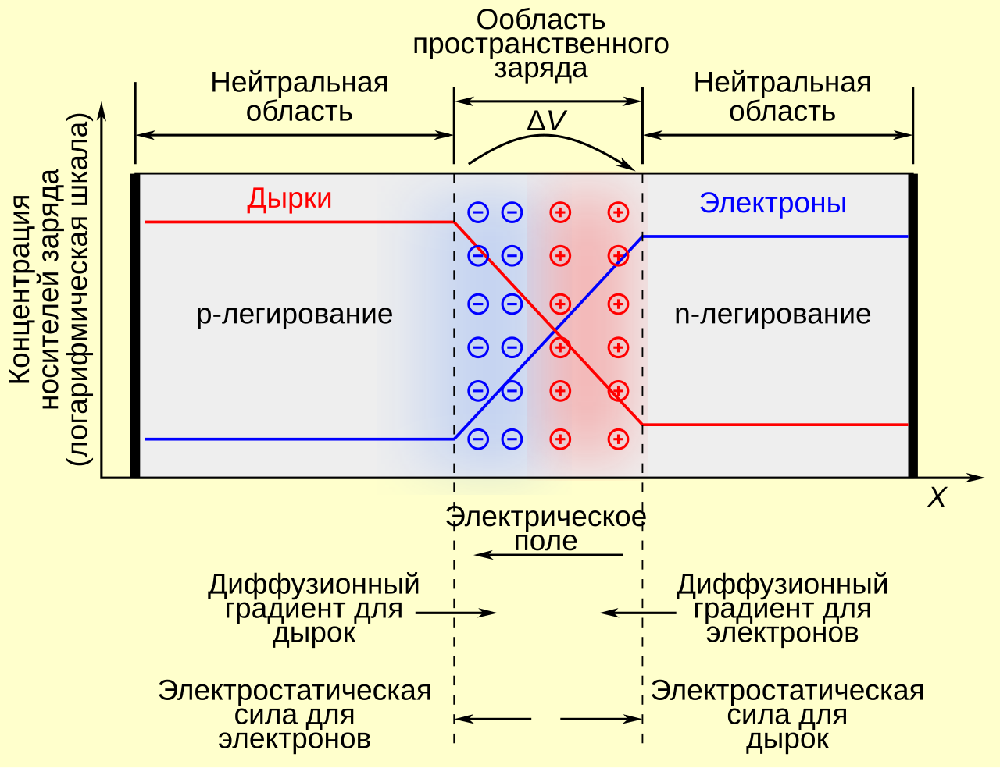

## 1. PN-переход

*p-n переходом* называют область соприкосновения полупроводников *p* и *n* типа.
> *p* - positive, дырки   *n* - negative, электроны

Зонная диаграмма - схематическое изображение распределения энергий носителей заряда.Валентная зона соответствует энергиям носителей заряда на внешних оболочках атома, зона проводимости - свободным носителям.

> Как мы видим, существуют *запрещенные зоны*, в которых носители не могут находиться.   Добавление примесей в полупроводник позволяет создать разрешенные уровни внутри запрещенных зон.

При соединении p и n полупроводников носители зарядов одного типа будут хаотично перескакивать в область носителей другого типа (диффузия, ***диффузионный ток***). При установлении равновесия на стыке возникнет пространственное распределение зарядов и разность потенциалов (в комнатных условиях для кремния $\approx 650mV$). Эта разность потенциалов создает так называемый ***дрейфовый ток*** в противоположную от диффузионного тока сторону. В конце концов в системе установится равновесие, и распределение зарядов в пограничной зоне будет фиксированным. Эта зона и называется ***p-n переходом***.

В полупроводнике приложение внешних потенциалов приводит к смещению энергетических границ зон. Зонная диаграмма p-n перехода:

> Слева - в отсутствие внешних потенциалов   По центру - прямое напряжение (***смещение***)   Слева - обратное напряжение.

При подаче прямого напряжения (***Прямое смещение***) граница pn-перехода сужается, и диффузионный ток начинает преобладать над дрейфовым. Эта ситуация аналогична прямому подключению диода ("пропускает"). ВАХ такой системы будет экспоненциальной (см. формулу Шокли).

При подаче обратного напряжения (***Обратное смещение***) граница pn перехода резко утолщается, из за чего диффузионный ток резко уменьшается, остается только малый ($\approx 1\mu A$ для кремния) дрейфовый ток. Ситуация аналогична обратному подключению диода, то есть pn-переход "запирает".

## 2. Биполярный транзистор

Устройство - ***Ларин с. 11***

Режимы работы - ***Недоконспекты с. 2***

Коэффициент усиления - ***Недоконспекты с. 3 п. "Соотн..."***

## 3. Усилители на BJT

Усилитель с общим эмиттером - ***Ларин с. 19***

Усилитель с общей базой - [Википедия](https://ru.wikipedia.org/wiki/%D0%A3%D1%81%D0%B8%D0%BB%D0%B8%D1%82%D0%B5%D0%BB%D1%8C%D0%BD%D1%8B%D0%B9_%D0%BA%D0%B0%D1%81%D0%BA%D0%B0%D0%B4_%D1%81_%D0%BE%D0%B1%D1%89%D0%B5%D0%B9_%D0%B1%D0%B0%D0%B7%D0%BE%D0%B9), ***Ларин с.18***

Характеристики - ***Недоконспекты с. 3-4***

## 4. МОП-транзистор (MOSFET)

Устройство - ***Ларин с. 15***

Виды каналов, характеристики - ***Ларин с. 17***

Пример усилителя, режим по току - ***Григорьев с. 34***

## 5. Расчет режима BJT по пост. току

Режим по пост. току - ***Недоконспекты с. 4-5***

Пример рассчета на нестаб. усилителе - ***Недоконспекты с. 6***

Расчет с наличием нагрузки - ***Недоконспекты с. 9-10***

## 6. Расчет режима MOSFET по пост. току

Усилитель с общим истоком, расчет режима по току и коэффициента усиления - ***Григорьев с. 34***

> Сначала лучше прочитать билет 4

## 7. (Не)стабилизиртованный усилитель.

Схемы и рассчет режима по пост. току:
- Нестабилизированный усилитель - ***Недоконспекты с.6***
- Стабилизированный усилитель - ***Недоконспекты с.7-8***

> Возможно можно обратиться к материалам билета 10 без вывода

## 8. Физическая схема BJT

Кратко - ***Лаба28 с. 14-15***

Развернуто - ***Ларин с. 30-41***

> Я бы сначала расписал по Ларину, а потом еще выписал соотношения с методички.

> Не забывайте, что все эквивалентные схемы работают только в фикс. рабочей точке при малых переменных сигналах.   (За исключением модели Эбберса-Мола)

## 9. Схема BJT через h-параметры

Короткий путь по Ларину:
- h-параметры линейного четырехполюсника - ***Ларин с. 41***
- Связь h-параметров с физ.схемой - ***Ларин с. 42***

Если хотите выпендрится:
- Модель Эбберса-Мола: - ***Недоконспекты с. 12-13***
- h-параметры - ***Недоконспекты с. 14***
- h-параметры как линеаризация модели Э-М - ***Недоконспекты с. 15***
- Физическая схема + связь с h-параметрами - ***Недоконспекты с. 16***

## 10. Резисторный усилитель

Нагрузочная кривая - ***Недоконспекты с. 9-10***

Общая схема усилителя - ***Недоконспекты с. 17***

Транзисторный усилитель - ***Недоконспекты с. 18-19***

Эквивалентная схема нестабилизированного - ***Недоконспекты с. 20-21***

Эквивалентная схема стабилизированного + эквивалентность - ***Недоконспекты с. 22***

> В конспектах не указано, но данная схема для малых сигналов называется ***Резисторным усилителем***

Рассчет параметров - ***Недоконспекты с. 23-25***

Замечание про вид АЧХ - ***Ларин с. 48***

## 11. АЧХ резисторного усилителя

Пример: стабилизированный усилитель + приведение к **РезУс** - ***Недоконспекты с. 22***

Замечание про вид АЧХ - ***Ларин с. 48***

Нижние частоты в случае $C_б$ - ***Недоконспекты с. 26-27***

> Тут же я бы вставил рисунок АЧХ/ФЧХ - ***Ларин с. 54***

Нижние частоты в случае конечности $C_э$ - ***Ларин с. 54 "В стабилизированном..."***

Верхние частоты - ***Ларин с. 55-57***

## 12. Дифференциальный усилитель

Общий вид и параметры - ***Ларин с. 63-65***

> Хз, входит ли это в билет: **ДифУс** на BJT - ***Ларин с. 65-69*** 

## 13. Источники постоянного тока. Токовое зеркало.

Источники стабильного тока - ***Ларин с. 69-70*** (+1 абзац с с.71)

Токовое зеркало - ***Ларин с. 71-72***

## 14. Токовое зеркало как ист. тока и как дин. нагрузка

> Прочитать предыдущий билет

Токовое зеркало + исп. как ист. тока - ***Ларин с. 71-72***

> Схема диф. усилителя на BJT - ***Ларин с. 66 рис. 4.4*** 

**ТЗ** в качестве дин. нагрузки - ***Ларин с. 72-73***

## 15-19. Обратные связи в усилителях

> Эти билеты сильно связаны между собой, решил объединить их в один пункт. Действовать по ситуации.

Общий вид обратной связи - ***ОбрСвязи с. 1***

Последовательные ОС - ***ОбрСвязи с.10-12***. Сверху - по напряжению, снизу - по току.

Параллельные ОС - ***ОбрСвязи с.13-16***.

## 20. Частотные свойства усилителей с обр.связью

Однокаскадный усилитель - ***ОбрСвязи с.6***

Двукаскадный усилитель - ***Ларин с.83-84***

## 21. Источники тока на основе ОУ

> Странный билет

ОУ как источник тока - ***Лаба77, с. 24***

Вывод соотношений - ***ОУИсточник***

Требование на сопротивление - ***ОперУсил с.23***

## 22. Устойчивость ОС

Диаграмма Найквиста - ***Ларин с. 78***

Вывод граничной окружности, формулировка критерия Найквиста - ***Ларин с. 79***

Годографы петлевого усиления для 1(2)-каскадных усилителей - ***Ларин с. 79-81***

## 23. Двухтактный эмиттерный повторитель в качестве усилителя мощности

Я бы тут упомянул структурную схему ОУ - ***Ларин с. 93*** + картинка ***ОперУсил с.10***

Усилитель мощности - ***Ларин с.93-97***

## 24. Операционный усилитель и его параметры

> Сначала стоит вспомнить про диф. усилитель (билет 12)

Маркировка, параметры, структура - ***ОперУсил с. 8-10***

> Не забыть упомянуть про балансировку и частоту единичного усиления

АЧХ, ФЧХ - ***ОперУсил с. 17***

## 25. Идеальный ОУ

Идеальный ОУ - ***Ларин с. 98***

Выходная характеристика - ***ОперУсил с. 16***

Принцип виртуального замыкания - ***МетодыРТ с.37***

## 26-27. Применение ОУ, частотно-зависимая обратная связь

Инвертирующий усилитель - ***ОперУсил с. 19***

Неинвертирующий усилитель + бонус - ***МетодыРТ с. 38***

Какой то разностный усилитель - ***ОперУсил с. 20***. (Вычитание)

Сумматор - ***МетодыРТ с. 43***

Интегратор/дифференциатор - ***МетодыРТ с. 45-46***.

Вывод соотношений для дифференциаторов - ***ОУДифф***

Логарифмический преобразователь - ***ОперУсил с.22***

> В целом, можно выпендриться и взять еще схемы из ***Лаба77***

## 28. Резонансный усилитель с КК в качестве нагрузки

> На этом моменте я понял, что надо было все лекции склеить в одну пдфку под одним названием. Делать это я не буду, впадлу фиксить нумерацию.

Параллельный КК - ***ОперУсил с. 27***

Схема резонансного усилителя ***ОперУсил с. 28-29***. Можно обратиться к ***Ларин с. 116-119***.

АЧХ и ФЧХ должны быть как у обычного полосового усилителя, типо такого (картинка с гугла):

## 29. Устойчивость резонансного усилителя

Устойчивость - ***Ларин с.119-123***.